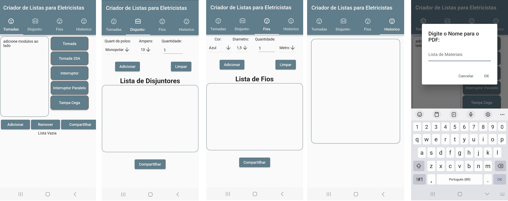

# Tomadeiro
 
 o Tomadeiro é um app que cria lista de materiais para serem usados em um orçamento para o eletricista, decidi recriar esse aplicativo em Flutter
 
## Getting Started

essa é uma nova versao em do: [Tomadeiro cordova](https://github.com/gvpassos/Tomadeiro), porém planejo aumentar as funcionalidades e implementar um código mais limpo e documentado.

interfaces 
